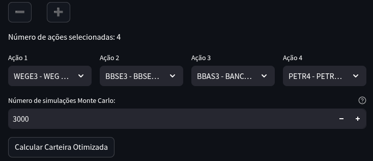
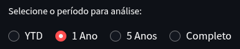
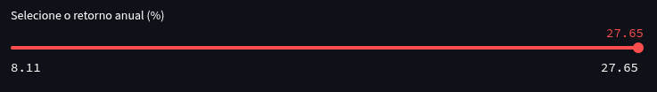
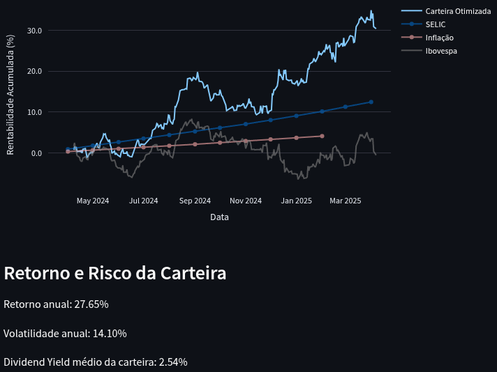
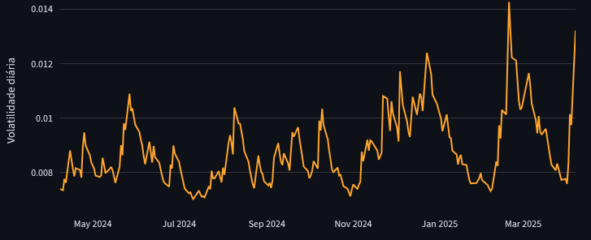
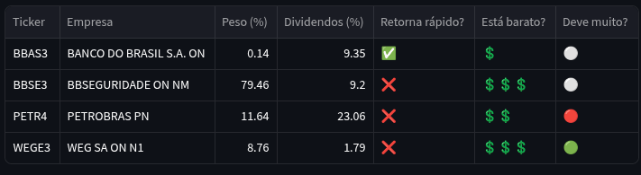

# 📈 Otimizador de carteiras de ações da B3 com Monte Carlo

Este projeto consiste em uma aplicação interativa desenvolvida com **Python** e **Streamlit**, com o objetivo de auxiliar investidores no estudo e simulação de carteiras de ações do mercado brasileiro. A aplicação utiliza métodos quantitativos avançados para otimizar carteiras e avaliar seu desempenho histórico.

**Use o Assistente direto no Streamlit**: https://basic-b3-stock-assistant.streamlit.app/

## 🚨 Aviso Importante

**Este projeto possui caráter exclusivamente educacional e não substitui o auxílio de um profissional autorizado na área de investimentos. Utilize-o como ferramenta complementar ao seu estudo pessoal sobre investimentos.**

---

## 🔍 Metodologia e Funcionamento

Todo o processo de **ETL (Extração, Transformação e Carregamento)** é realizado diretamente no script ``app.py``:

- **Extração**: Os dados são coletados através das APIs do **Banco Central (BCB)** e do **Fundamentus**, garantindo informações atualizadas sobre mercado e indicadores financeiros.
- **Transformação**: Aplicam-se métodos quantitativos avançados como a simulação Monte Carlo e modelos econométricos GJR-GARCH para otimizar e avaliar carteiras.
- **Carregamento**: Os resultados finais e visualizações são carregados e exibidos diretamente no Streamlit, permitindo interação em tempo real com o usuário.

### 1. **Seleção das Ações**

O usuário pode selecionar entre **2 a 12 ações** listadas na bolsa brasileira (B3). As ações são escolhidas por meio de uma interface interativa.

### 2. **Simulação Monte Carlo**

Após a seleção das ações, o aplicativo executa milhares de simulações de carteiras com pesos aleatórios. Cada carteira simulada é avaliada pelo seu retorno esperado anualizado, volatilidade anualizada e índice de Sharpe (relação retorno/risco).

A carteira com o maior índice de Sharpe é apresentada como a carteira otimizada.

### 3. **Avaliação da Volatilidade**

Para quantificar e visualizar a volatilidade histórica da carteira selecionada, o modelo **GJR-GARCH(1,1,1)** é aplicado. Esse modelo captura a volatilidade condicional e o efeito assimétrico das notícias sobre o mercado, oferecendo uma visão mais realista do risco da carteira.

### 4. **Comparação com Indicadores Econômicos**

A aplicação exibe gráficos comparativos da rentabilidade histórica da carteira em relação à:

- Taxa básica de juros (SELIC)
- Inflação acumulada (IPCA)

### 5. **Indicadores Fundamentalistas**

A carteira selecionada é complementada com análises fundamentalistas das ações, incluindo:

- Dividend Yield ponderado
- Indicadores financeiros como Dívida Bruta/Patrimônio, P/L e P/VP
- Emojis visuais intuitivos que classificam a saúde financeira das empresas

---

## 🛠️ Tecnologias Utilizadas

- **Python**
- **Streamlit** (interface interativa)
- **Pandas e NumPy** (manipulação e cálculo de dados)
- **Plotly** (visualizações interativas)
- **arch** (modelos de volatilidade GARCH)
- **scipy** (otimização matemática)

---

## 🚀 Como Utilizar (localmente)

### Instalação das dependências

```bash
pip install -r requirements.txt
```

### Execução da aplicação

```bash
streamlit run app.py
```

Abra seu navegador e acesse `http://localhost:8501`.

---

## 📝 Estrutura do Projeto

```
📁 utils
  ├── data_fetcher.py   # Coleta dados de mercado e indicadores
  ├── optimizer.py      # Otimizadores de carteira

📄 app.py                # Aplicação principal Streamlit
📄 sectors.csv           # Lista de ações e seus setores
📄 requirements.txt      # Dependências do projeto
```

---

## 🧑‍💻 Instruções de uso

1. **Selecione as ações** que deseja incluir na carteira. Use os botões '+' ou '-' para ajustar o número de ações entre 2 e 12.

2. **Escolha o número de simulações** do método de Monte Carlo (padrão: 3000 simulações; máximo: 10000 simulações). Quanto maior o número de simulações, mais preciso tende a ser o resultado, mas o tempo de cálculo será proporcionalmente maior.

3. **Clique em "Calcular Carteira Otimizada"** para gerar a análise.

    

4. Após o cálculo da propoção dos ativos da carteira, use o seletor de período para análisar a relação risco-retorno ao longo do ano atual, também considerando 1 ou 5 anos, e por último a série histórica completa destes ativos.

    

5. Use o slider para mudar a proporção dos ativos na carteira conforme o retorno desejado.
  - Nota: por padrão o valor de retorno que aparece no slider após o cálculo da carteira otimizada, é o valor de maior retorno com o menor risco calculado

  - **Dica**: ajuste o valor de retorno de modo a minimizar o risco e balancear o peso dos ativos na carteira. Uma carteira de risco baixo e alto retorno, mas com o peso elevado para um único ou poucos ativos, não necessariamente significa ser sustentável no curto prazo.

    

---

## 📊 Interpretação dos resultados

Após o cálculo da carteira otimizada, você terá acesso aos seguintes resultados:

- **Rentabilidade acumulada da carteira**: Exibe o desempenho histórico da carteira otimizada, comparado à taxa SELIC, à inflação (IPCA) e ao índice Ibovespa, permitindo entender o comportamento relativo dos investimentos ao longo do tempo.

  

- **Volatilidade condicional (GJR-GARCH)**: Demonstra como o risco da carteira se comportou historicamente, destacando períodos de alta e baixa volatilidade. Períodos com volatilidade elevada indicam momentos de maior incerteza e risco.

  

- **Indicadores fundamentalistas**: Fornecem insights adicionais sobre a qualidade das empresas escolhidas:
  - **Peso**: Qual deve ser a proporção de uma determinada ação dentro da carteira para que se obtenha a relação risco-retorno calculada.
  - **Dividend Yield**: Retorno médio esperado com dividendos das ações.
  - **P/L**: Indica quanto tempo (em anos) leva para o lucro da empresa cobrir o preço pago pela ação. Representado pela coluna 'Retorna rápido?'.
  - **P/VP**: Avalia o valor de mercado da empresa em relação ao seu valor patrimonial. Representado pela coluna 'Está barato?'
  - **Dívida Bruta/Patrimônio**: Indicador do nível de endividamento das empresas. Representado pela coluna 'Deve muito?'.


  

- **Composição da carteira por Setor**: Baseado nos ativos selecionados e na proporção calculada da carteira, este gráfico exibe os setores produtivos onde empresas estão stiuadas. Esta é uma informação importante quando pensamos em diversificação dos investimentos.

  

Esses resultados permitem avaliar a qualidade da carteira montada, ajudando na compreensão do equilíbrio risco-retorno e na tomada de decisões mais informadas.

---

## 🤝 Colaborações

Contribuições, sugestões, correções e melhorias serão sempre bem-vindas. Sinta-se à vontade para abrir uma issue ou pull request!

---

## 📌 Licença

Este projeto está disponível para uso educacional e pessoal, não comercial.

---

📩 **Dúvidas ou sugestões? Entre em contato!**

Mail: antolin.luis@gmail.com

LinkedIn: https://www.linkedin.com/in/luis-antolin/